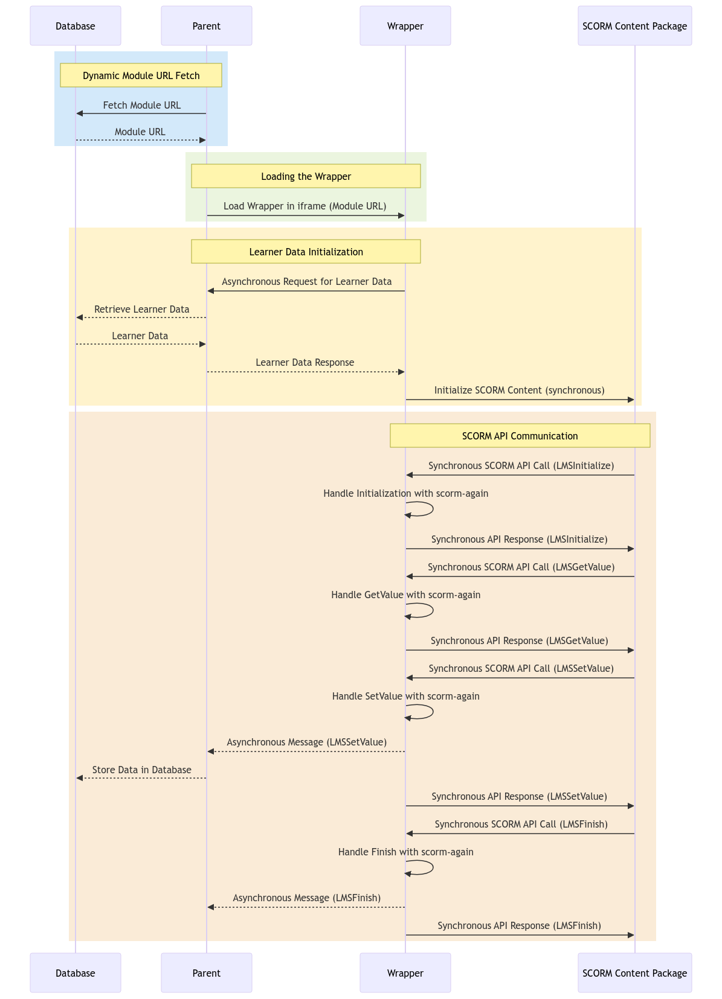

# **SCORM2CMS Integration System Manual and API Documentation**

## **Overview**

This system bridges SCORM-based e-learning content with your CMS, allowing seamless learner progress tracking and module loading. The setup consists of three primary components:

### 1. **Parent Layer**

-   Acts as the main interface integrated with your CMS.
-   Handles:
    -   Dynamically fetching module URLs based on the page or learner.
    -   Loading the SCORM Wrapper into an iframe.
    -   Asynchronous communication with the wrapper for learner data storage.

### 2. **Wrapper Layer**

-   Wraps the SCORM content and translates SCORM API calls into asynchronous messages.
-   Uses the `scorm-again` library to simulate LMS behavior.

### 3. **Mock Server**

-   Represents the CMS's database and APIs.
-   Simulates API endpoints for:
    -   Fetching learner data.
    -   Storing learner data.
    -   Fetching SCORM module URLs.

---

## **Project Structure**

### Parent Layer Files

-   **`index.html`**:
    -   Loads the `parent.ts` script.
    -   Includes an iframe (`#wrapper-iframe`) for the SCORM wrapper.
-   **`parent.ts`**:
    -   Main parent script.
    -   Handles iframe communication, logging, and dev tools.
-   **`parent-event-handlers.ts`**:
    -   Customizable event handlers for API interactions and iframe messaging.

### Wrapper Layer Files

-   **`wrapper.ts`**:
    -   Handles SCORM API communication with the content package.
    -   Relays SCORM events to the parent.

### Mock Server

-   Serves mock data and SCORM URLs for development:
    -   Learner data (via `.env` URLs).
    -   Example module URL pointing to a hosted wrapper.

---

## **Setup and Configuration**

### Environment Variables (`.env`)

-   **`VITE_TRUSTED_DOMAINS`**:
    -   Comma-separated list of domains allowed for `postMessage` communication.
    -   Replace the wildcard (`*`) with your CMS and SCORM package domains.
-   **`VITE_SECRET_TOKEN`**:
    -   Token for securing `postMessage` API communication.
-   **`VITE_LMS_SERVER_FETCH`**:
    -   API endpoint to fetch learner data.
-   **`VITE_LMS_SERVER_STORE`**:
    -   API endpoint to store learner progress.
-   **`VITE_LMS_SERVER_URL`**:
    -   API endpoint to fetch SCORM module URLs dynamically.

---

## **Workflow**

### 1. **Dynamic Module Loading**

-   **Parent**:
    -   Fetches the SCORM module URL dynamically from the server.
    -   Updates the iframe source to load the **Wrapper** with the fetched URL.

### 2. **Learner Data Initialization**

-   **Wrapper**:
    -   Requests learner data from the **Parent** before initializing the SCORM content.
    -   Ensures that SCORM interactions operate with the correct learner context.

### 3. **SCORM Communication**

-   **Wrapper**:
    -   Handles synchronous SCORM API calls using `scorm-again`.
    -   Sends asynchronous messages to the **Parent** about SCORM activities.
-   **Parent**:
    -   Processes SCORM events asynchronously, storing learner progress in the database.

---

## **Key Scripts**

### **Parent Layer**

#### `parent.ts`

-   Handles:
    -   Dynamic URL fetching (`VITE_LMS_SERVER_URL`).
    -   Iframe communication with the Wrapper.
    -   Logs SCORM communication for debugging.

#### Example Initialization:

```typescript
const iframe = document.getElementById('wrapper-iframe') as HTMLIFrameElement;
iframe.src = fetchedModuleUrl; // Dynamically set based on the page or learner.
```

### **Wrapper Layer**

#### `wrapper.ts`

-   Uses scorm-again for SCORM handling.
-   Sends messages to the parent for storing data asynchronously.

SCORM API Example:

```typescript
window.API.LMSInitialize(); // Initializes SCORM content.
window.API.LMSSetValue('cmi.core.score.raw', '90'); // Sets learner score.
```

---

## **API Endpoints**

### 1. **Fetch Module URL**

-   **Endpoint**: `GET /api/lms/scorm-url`
-   **Purpose**: Retrieves the URL for the SCORM wrapper based on the current page or learner.

### 2. **Fetch Learner Data**

-   **Endpoint**: `GET /api/lms/learner-data`
-   **Purpose**: Provides learner data to initialize SCORM content.

### 3. **Store Learner Data**

-   **Endpoint**: `POST /api/lms/learner-data`
-   **Purpose**: Stores SCORM progress and interactions in the database.

---

## **Customization Points**

### 1. **parent-event-handlers.ts:**

-   Add custom logic for handling SCORM events and database communication.
-   Example:

```typescript
export function handleScormEvent(event: MessageEvent) {
	if (event.data.type === 'LMSSetValue') {
		storeDataToDatabase(event.data);
	}
}
```

### 2. **Environment Variables:**

-   Replace mock URLs with production API endpoints.

---

## Development Notes

-   **Logging:**
    -   Adjust loggerSettings.logLevel in parent.ts for verbose debugging (0–5).
    -   Use devMode to enable log tables and additional debug tools.
-   **Testing:**
    -   Use the mock server to simulate CMS and database behavior during development.
-   **Security:**
    -   Set VITE_TRUSTED_DOMAINS to restrict communication to trusted origins.
    -   Ensure VITE_SECRET_TOKEN is secure and consistent between the Parent and Wrapper.

---

## SCORM v1.2 JSON Schema Example

**Note:** All fields are strings! SCORM doesn't know any other data types.

```json
{
	"suspend_data": "{\"completionStatus\":\"incomplete\",\"learnerName\":\"Marianna\",\"learnerId\":\"12345\",\"totalTime\":\"02:32:02.37\",\"bookmark\":5,\"score\":\"25\",\"lastSlideType\":\"hotspot\",\"currentVideoTime\":0,\"coinScore\":{\"start\":{},\"v1\":{\"earned\":1},\"menu\":{},\"v2\":{\"earned\":1},\"i1\":{},\"v3\":{},\"i2\":{},\"v4\":{},\"i3\":{},\"i4\":{},\"i4b\":{},\"v5\":{},\"i5\":{},\"v6\":{},\"i6\":{},\"q1\":{},\"q2\":{},\"q3\":{},\"end\":{},\"totalScore\":2,\"disclaimer\":{},\"is1\":{}},\"slideCompletion\":{\"mainPath\":{\"v1\":1,\"v2\":1,\"i1\":0,\"v3\":0,\"i2\":0,\"v4\":0,\"i3\":0,\"i4\":0,\"i4b\":0,\"v5\":0,\"i5\":0,\"v6\":0,\"i6\":0,\"q1\":0,\"q2\":0,\"q3\":0,\"is1\":0}}}",
	"launch_data": "",
	"comments": "",
	"comments_from_lms": "",
	"core": {
		"student_id": "12345",
		"student_name": "Marianna",
		"lesson_location": "5",
		"credit": "",
		"lesson_status": "incomplete",
		"entry": "",
		"lesson_mode": "normal",
		"exit": "suspend",
		"session_time": "00:00:00",
		"score": {
			"raw": "25",
			"min": "0",
			"max": "100"
		},
		"total_time": "02:32:03.39"
	},
	"objectives": {},
	"student_data": { "mastery_score": "", "max_time_allowed": "", "time_limit_action": "" },
	"student_preference": { "audio": "", "language": "", "speed": "", "text": "" },
	"interactions": {}
}
```

---

## Sequence Diagram


