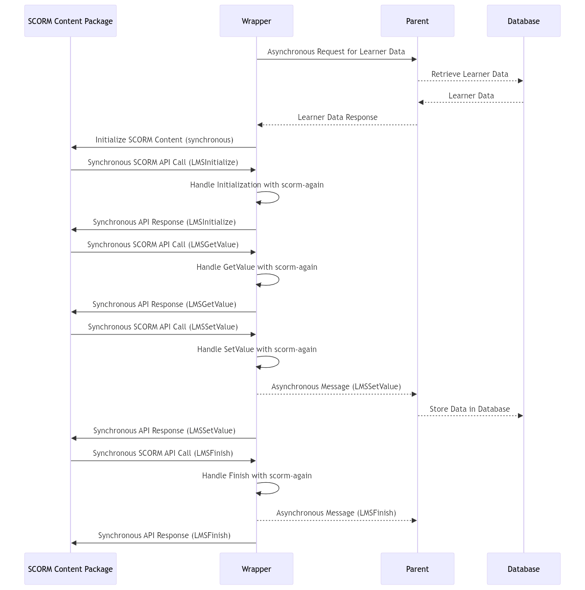

# SCORM2CMS Prototype

### System Overview

The system is designed to bridge the gap between the synchronous SCORM content and modern asynchronous web applications. The wrapper plays a crucial role in managing this communication, ensuring that SCORM interactions are handled correctly while enabling the parent to perform necessary database operations asynchronously. This setup allows for a robust and flexible system that can be customized by the client to fit specific needs.

The system consists of three primary components: the **Parent**, the **Wrapper**, and the **SCORM Content Package**. Each layer has a specific role in the communication and data flow, ensuring that the SCORM-compliant content interacts smoothly with the client's database and the learner's data.

- **Wrapper**: Acts as an intermediary, handling all synchronous SCORM operations using `scorm-again` and informing the **Parent** asynchronously about important events.
- **Parent**: Receives and processes asynchronous messages, primarily to store data in the **Database** after SCORM interactions.
- **Asynchronous Communication**: Allows the **Parent** to handle database operations without affecting the synchronous flow required by SCORM.

This setup ensures that SCORM communication remains synchronous within the SCORM content package while leveraging asynchronous operations for database interactions and data management.

#### **Sequence Diagram**

### Explanation:

1. **Initial Data Retrieval**:
   - **Wrapper** starts by making an asynchronous request to the **Parent** for the learner's current data.
   - **Parent** retrieves this data from the **Database** (simulated by the JSON file) and sends it back to the **Wrapper**.
   - Once the data is received, the **Wrapper** initializes the SCORM content package synchronously, using the retrieved data.

2. **SCORM Initialization**:
   - After initialization, the SCORM Content Package sends a synchronous `LMSInitialize` call to the **Wrapper**.
   - The **Wrapper** handles this call using the `scorm-again` library, which acts as the LMS during runtime.
   - The **Wrapper** then responds to the SCORM Content Package synchronously.

3. **SCORM API Calls**:
   - **LMSGetValue** and **LMSSetValue** are handled synchronously by the **Wrapper** using `scorm-again`.
   - When **LMSSetValue** is called, the **Wrapper** sends an asynchronous message to the **Parent** to store the updated data in the **Database**.
   - The **Wrapper** responds to the SCORM Content Package synchronously, ensuring smooth operation within the SCORM environment.

4. **SCORM Finish**:
   - When the SCORM content is finished (via `LMSFinish`), the **Wrapper** handles the call, informs the **Parent** asynchronously, and completes the process synchronously with the SCORM package.

#### 1. **SCORM Content Package**
   - **Role**: The SCORM content package is the actual educational content that the learner interacts with. This content follows the SCORM standard, which requires synchronous communication with an LMS (Learning Management System).
   - **Communication**: The SCORM package communicates with the LMS (which is simulated by the wrapper) using synchronous SCORM API calls, like `LMSInitialize`, `LMSGetValue`, and `LMSSetValue`.
   - **Challenges**: SCORM communication is synchronous, which poses challenges when integrating it with modern asynchronous web technologies like the `postMessage` API.

#### 2. **Wrapper**
   - **Role**: The wrapper acts as an intermediary between the SCORM content package and the parent. It simulates an LMS for the SCORM content, using the `scorm-again` library to handle SCORM API calls. 
   - **Functionality**:
     - **SCORM Handling**: The wrapper intercepts all SCORM API calls from the content package and processes them using the `scorm-again` library. This library acts as a fake LMS, handling operations like data retrieval and storage synchronously within the wrapper.
     - **Parent Communication**: The wrapper informs the parent about each SCORM interaction via the `postMessage` API. This communication is asynchronous and allows the parent to perform database operations in response to SCORM interactions.
     - **Data Initialization**: Before initializing the SCORM content package, the wrapper requests the learner's data from the parent. Once the data is received, the wrapper initializes the content, ensuring that the SCORM part operates synchronously.
   - **Challenges**: The wrapper must handle both synchronous SCORM communication and asynchronous communication with the parent. This requires careful synchronization to ensure that the SCORM package operates correctly while allowing the parent to handle database operations asynchronously.

#### 3. **Parent**
   - **Role**: The parent acts as the top-level controller, interacting with the wrapper and performing necessary database operations.
   - **Functionality**:
     - **Data Retrieval**: When the wrapper requests the learner’s current data, the parent retrieves it (simulated in the prototype by a JSON file) and sends it back to the wrapper.
     - **Asynchronous Operations**: The parent asynchronously processes SCORM interactions, such as storing updated learner progress or retrieving data when requested by the wrapper.
     - **Event Handling**: The parent is designed to be customized by the client. The client can add logic to handle various events triggered by the wrapper's messages, like logging, database updates, or custom business logic.
   - **Challenges**: The parent must handle asynchronous communication while ensuring that the wrapper and SCORM package remain in sync. This requires careful management of the messaging system to avoid delays or missed updates.

### Challenges and Ideas Behind the System

1. **Synchronous vs. Asynchronous Communication**:
   - **Challenge**: SCORM’s synchronous nature clashes with the asynchronous nature of modern web APIs like `postMessage`. Directly linking SCORM’s synchronous calls to asynchronous operations can lead to timing issues and data inconsistencies.
   - **Solution**: The `scorm-again` library within the wrapper handles all synchronous SCORM communication. Asynchronous operations are confined to communication between the wrapper and the parent, ensuring that the SCORM content remains unaffected by the asynchronous nature of web communication.

2. **Data Initialization**:
   - **Challenge**: SCORM content requires initial data (like learner progress) to be present before it begins operation. This data often comes from a database managed by the parent.
   - **Solution**: The wrapper requests the necessary learner data from the parent before initializing the SCORM content. This ensures that the SCORM package can start with the correct data, and the operations remain synchronous within the content package.

3. **Customization and Extensibility**:
   - **Challenge**: The client needs to customize the parent layer to integrate their logic, like database operations, logging, and event handling.
   - **Solution**: The parent layer is designed to be flexible, with clear points where the client can insert custom logic. The client interacts primarily with `parent.ts`, adding logic around the wrapper’s messages.

### Conclusion

The system is designed to bridge the gap between the synchronous SCORM content and modern asynchronous web applications. The wrapper plays a crucial role in managing this communication, ensuring that SCORM interactions are handled correctly while enabling the parent to perform necessary database operations asynchronously. This setup allows for a robust and flexible system that can be customized by the client to fit specific needs.
